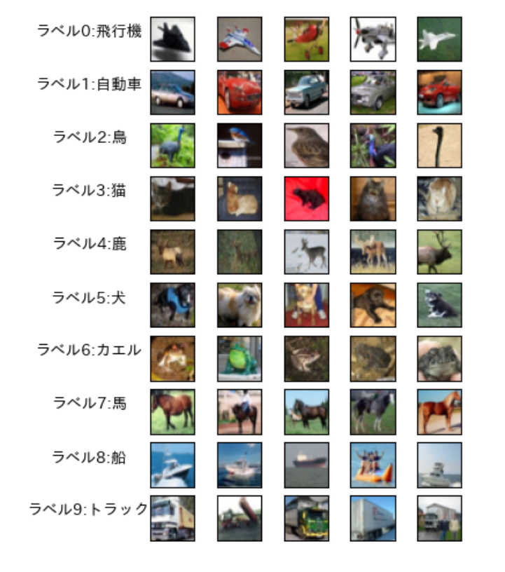
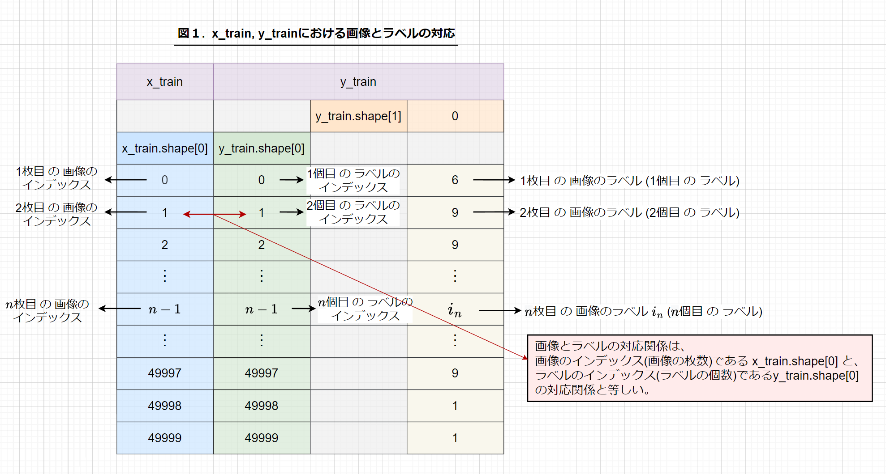

# 【研究①】cifar10 におけるラベルに対応する画像表示について

## 研究内容

&nbsp;

## 画像資料
### １. ラベルに対応する画像を複数表示

### ２. x_train、y_train における画像とラベルの対応

## 開発環境
Google Colaboratory  

&nbsp;

## ライセンス
"cifar10 におけるラベルに対応する画像表示について" is licenced under the [MIT license](https://en.wikipedia.org/wiki/MIT_License).
