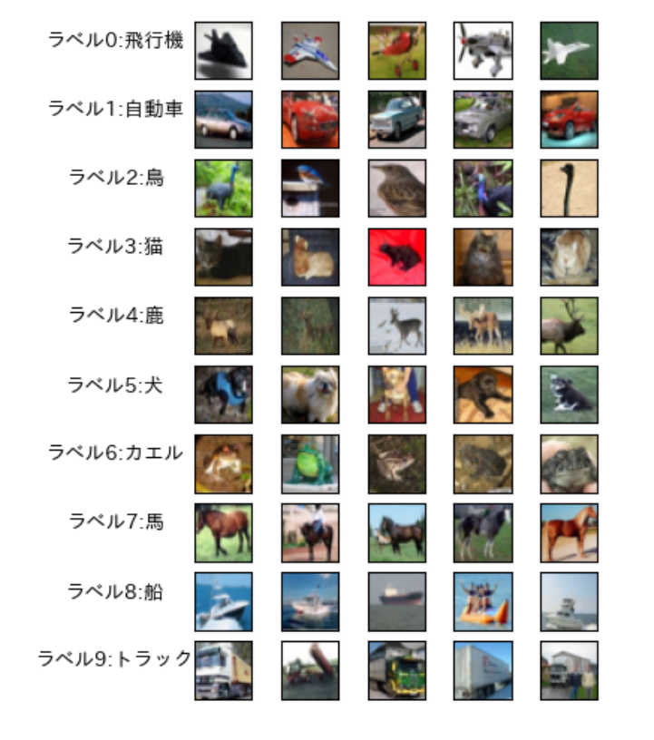
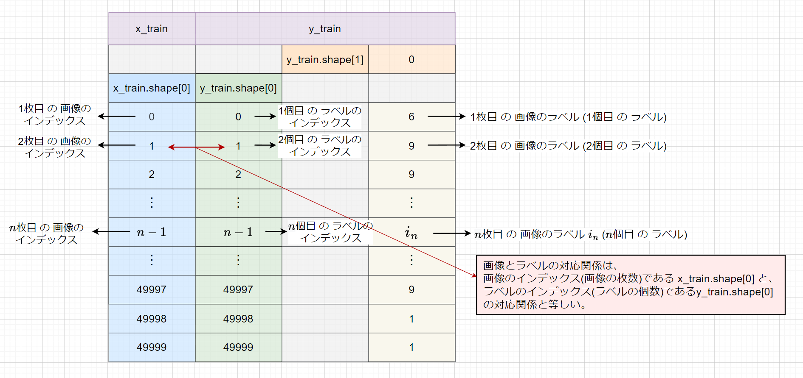
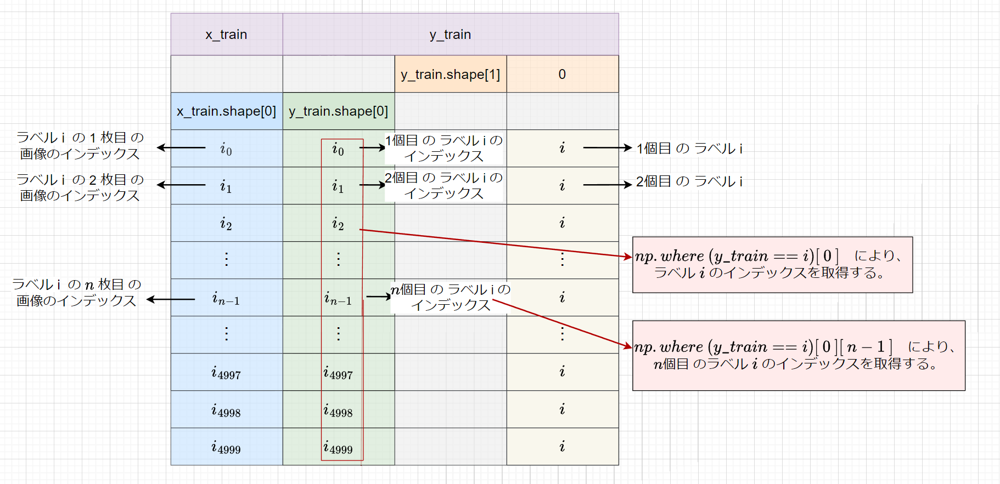

# 【研究①】cifar10 における各ラベルに対応する画像表示について

## 研究内容
・ラベル i の n 枚目の画像を表示するには、次のようなコードで表せる。
```
plt.imshow(x_train[label_i_idnex[n - 1], :, :, :])
```

ここで、 
```
label_i_idnex ＝ np.where(y_train == i)[0]
```
であり、ラベル i のインデックスを表す。

・画像を複数表示する際には、
```
plt.subplots()
``` 
を用いて、画像表示を行列のように分かりやすく簡潔に記述。

## 画像資料
### １. ラベルに対応する画像を複数表示


### ２. x_train、y_train における画像とラベルの対応


### ３. ラベル i のインデックスを取得



## 開発環境
Google Colaboratory  
<p>&nbsp;</p>

## ライセンス
"cifar10 におけるラベルに対応する画像表示について" is licenced under the [MIT license](https://en.wikipedia.org/wiki/MIT_License).
